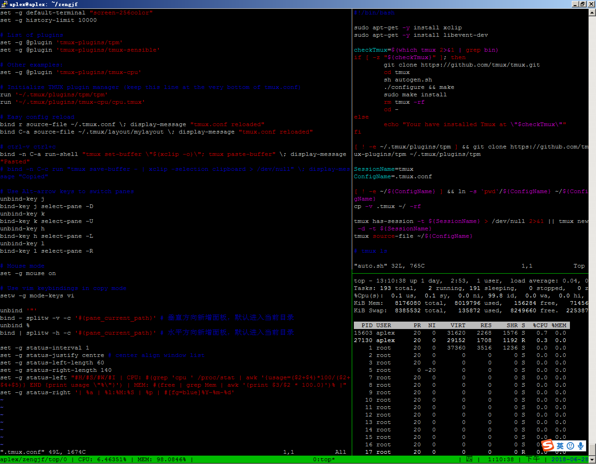

# Tmux

## 参考文档

* [Tmux使用手册](http://louiszhai.github.io/2017/09/30/tmux/)

## 使用方法

* clone这个仓库；
* shell执行`auto.sh`：
  * install lastest tmux
  * link .tmux.conf file
* 加载默认配置: `ctrl+b r`
* 复制: `ctrl+b space[ enter]`
* 粘贴: `ctrl+b a`
* 横分屏: `ctrl+b |`
* 竖分屏: `ctrl+b -`
* 左右上下移动屏：`ctrl+b [hjkl]`
* 使用内置的layout: `ctrl+b ctrl+a`
* 当前Tmux后台运行: `ctrl+b d`
* 创建一个会话，一个会话相当于一个屏幕，Tmux可以多屏切换的: `tmux new -s <session name>`
* 回到终端: `ctrl+b d`
* 查看当前所有的session列表: `tmux ls`
* 重新运行上次的Tmux: `tmux a`
* 打开指定的Tmux session: `tmux a -t <session name>`

## Tmux Plugin Manager

https://github.com/tmux-plugins/tpm

## 显示效果

